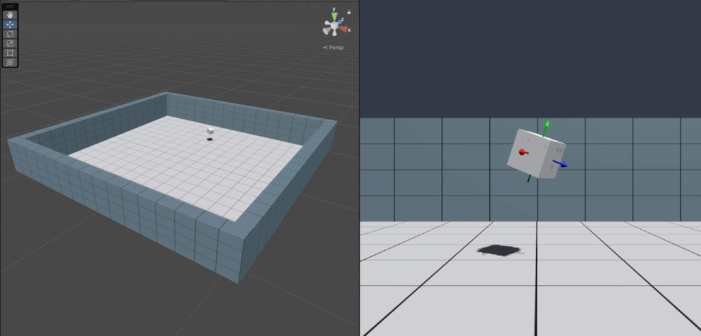

# XRC Core

## Overview
   
<!--  Provide a brief, high-level explanation of the package.-->
The XRC Core package is a utility package that serves as the foundation for other XRC packages. It provides XRC developers with a core set of tools to streamline the creation of applications, by simplifying the development process and accelerating iteration cycles.

## Installation instructions

### Package Manager
To install this package, follow these steps:
1. In the Unity Editor, click on Window > Package Manager
2. Click the + button and choose **Add package from git URL** option
3. Paste this URL https://github.com/xrcollaboratory/edu.cornell.xrc.core.git in the prompt and click on Add
4. If the package is private you might have to authenticate, if you have been granted access to this package
5. The package should be installed into your project
6. You can download Samples from under **Samples** in Package Manager

## Requirements	
<!-- This is a good place to add hardware or software requirements, including which versions of the Unity Editor this package is compatible with. -->

This package has been tested using Unity Editor 2022.3.7f1 (LTS).

Dependencies: XR Interaction Toolkit, Input System.

<!-- 
## Limitations	
If your package has any known limitations, you can list them here. If not, or if the limitations are trivial, exclude this section.
-->

## Workflows	
<!-- Include a list of steps that the user can easily follow that demonstrates how to use the feature. You can include screenshots to help describe how to use the feature. -->

Currently, the primary use case for this package is to use the prefabs that are distributed via the package samples, see below. 

<!-- 
## Advanced topics

This is where you can provide detailed information about what you are providing to users. This is ideal if you don’t want to overwhelm the user with too much information up front. 
-->

<!-- 
## Reference

If you have a user interface with a lot of properties, you can provide the details in a reference section. Using tables is a good way to provide quick access to specific property descriptions. 
-->

## Samples
<!-- For packages that include sample files, you can include detailed information on how the user can use these sample files in their projects and scenes.-->

### XRC Starter Assets

This sample offers a range of materials, models, prefabs, scenes, and other assets that are not shipped with the runtime package scripts. These assets provide a starting point for building virtual environments, saving developers time and effort during the initial setup process.

#### PlayArea

This prefab can be used as a standardized scene environment across different projects. See sample scene for usage example.

#### PoseMarker

This prefab can be used to indicate a pose of an object by placing it as a child of the object. See sample scene for usage example.

<!--
## Tutorials

If you want to provide a walkthrough for a complicated procedure, you can also add them here. Use step-by-step instructions and include images if they can help the user understand.
-->